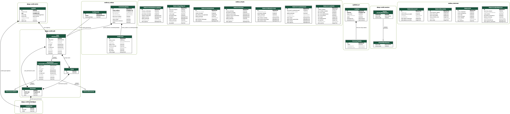

Database Erd
============
Diagrama ERD Completo do Banco de Dados
=======================================================

Este diagrama representa a estrutura física do banco de dados PostgreSQL, incluindo todas as tabelas do Django, chaves estrangeiras e tipos de dados.

Ele é gerado automaticamente a partir do código-fonte dos Modelos.

